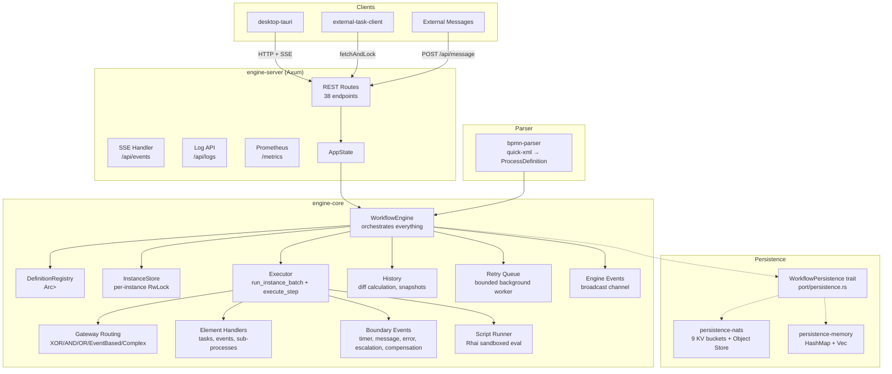

# Components

## Logical Component Map

## Component Responsibilities

### WorkflowEngine (engine-core)
**Owns:** All runtime state — definitions, instances, wait-state queues, persistence, event broadcast.
**Invariants:**
- Definitions are immutable after deploy (`Arc<ProcessDefinition>`)
- Tokens exist in exactly one place: `ProcessInstance.tokens: HashMap<Uuid, Token>`
- Pending tasks hold only `token_id: Uuid`, never copies of tokens
- All mutations go through `&self` (no `&mut self`) — interior mutability via Arc + DashMap/RwLock

### Executor (engine-core/src/engine/executor/)
**Owns:** Token execution loop, `NextAction` dispatch, instance completion logic.
**Entry points:** `run_instance_batch`, `execute_step`, `handle_next_action`

### Gateway Router (engine-core/src/engine/gateway.rs)
**Owns:** XOR (condition evaluation), AND (fork + join barrier), OR (multi-fork with conditions), EventBased (first-event-wins), Complex (custom logic).
**Key files:** `gateway.rs`

### Element Handlers (engine-core/src/engine/handlers/)
**Owns:** Per-BpmnElement-variant execution logic for tasks, events, sub-processes.
**Key files:** `tasks.rs`, `events.rs`, `gateways.rs`, `sub_processes.rs`

### Script Runner (engine-core/src/scripting/)
**Owns:** Rhai script execution with configurable resource limits (max operations, memory budget → collection caps, timeout).
**Entry points:** `ScriptConfig::build_engine()`, `execute_script_safe()`, listener helpers.

### History (engine-core/src/history/)
**Owns:** Audit trail generation, diff calculation, actor tracking, snapshots.

### Retry Queue (engine-core/src/engine/retry_queue.rs)
**Owns:** Fault-tolerant persistence retry — inline retries + **bounded** background worker (drop + metrics when full).

### engine-server
**Owns:** HTTP API surface (Axum routes), SSE broadcast bridge, timer scheduler, startup state restore, log buffer, durability gates (`REQUIRE_NATS`, upload limits).
**Invariants:** Never holds an engine lock across `.await` in route handlers. `/api/health` ≠ `/api/ready`.

### bpmn-parser
**Owns:** BPMN 2.0 XML parsing → `ProcessDefinition` structs, including ISO 8601 timer parsing.
**Entry point:** `parse_bpmn_xml(xml: &str) -> EngineResult<ProcessDefinition>`

### persistence-nats
**Owns:** NATS JetStream connection, KV bucket management, object store, all `WorkflowPersistence` trait methods.

### persistence-memory
**Owns:** In-memory `WorkflowPersistence` using `HashMap` + `Vec` — used for tests and dev mode.

### desktop-tauri
**Owns:** React UI (bpmn-js modeler, instance viewer, monitoring), Tauri command bridge to engine-server REST API, SSE event listener.

### external-task-client
**Owns:** TypeScript worker SDK — long polling, lock management, retry, graceful shutdown.
