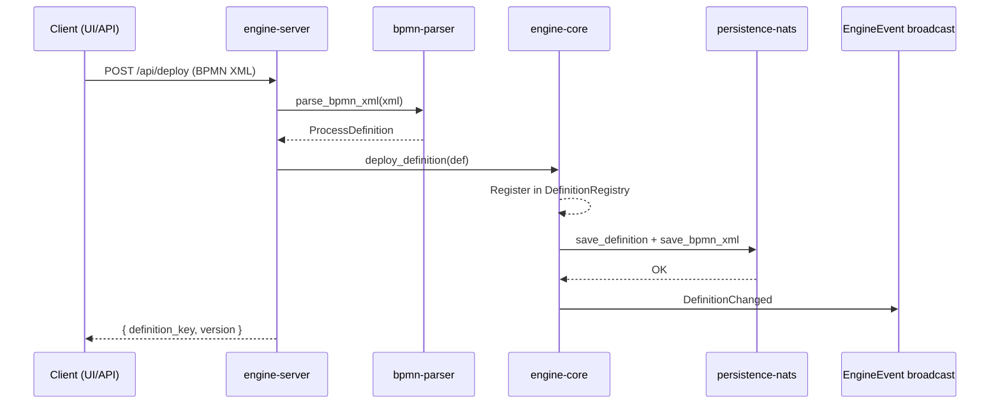
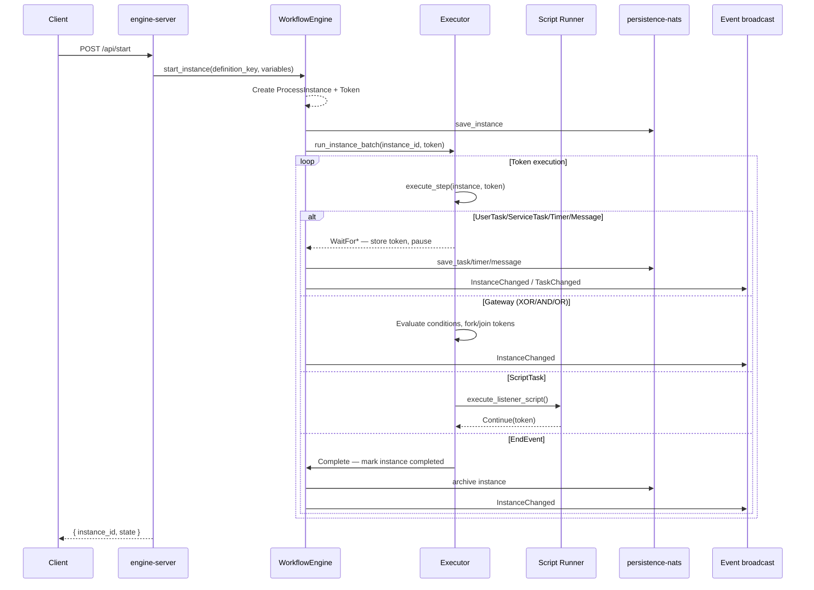
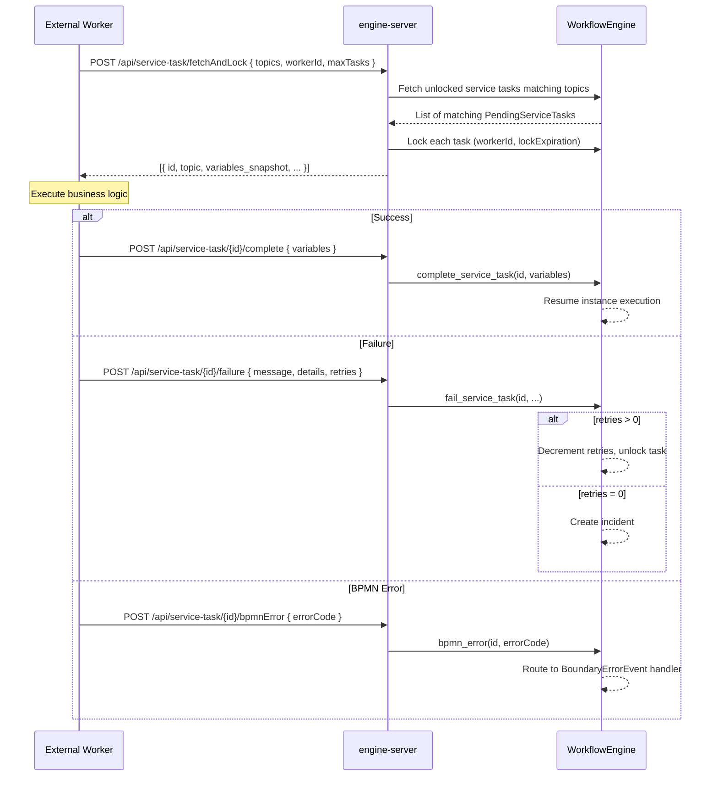
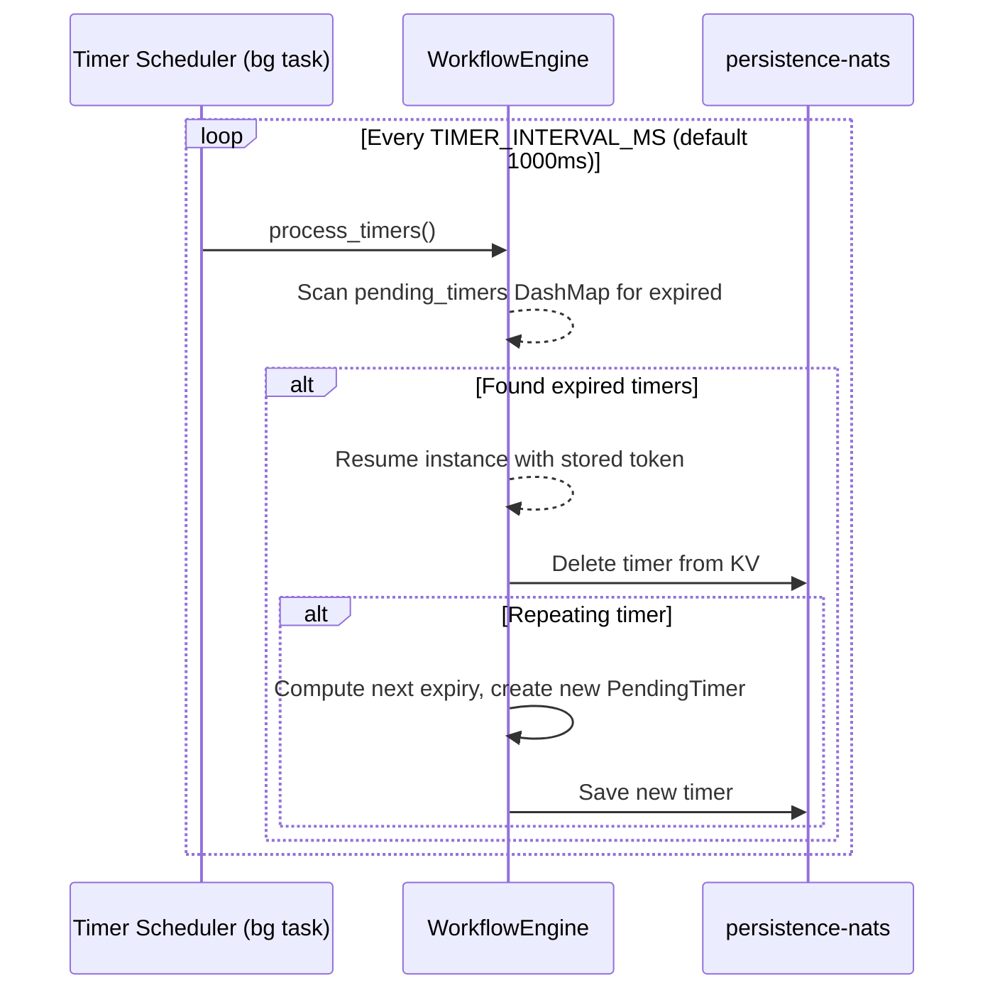
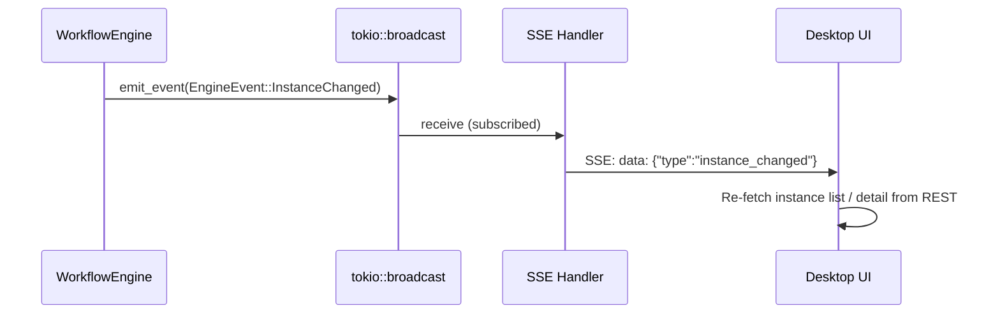
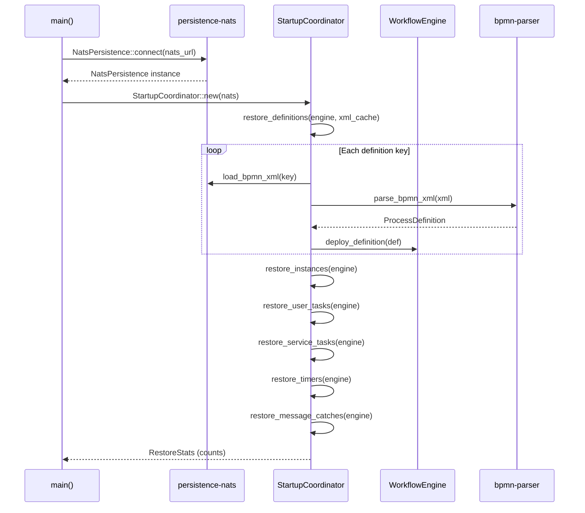
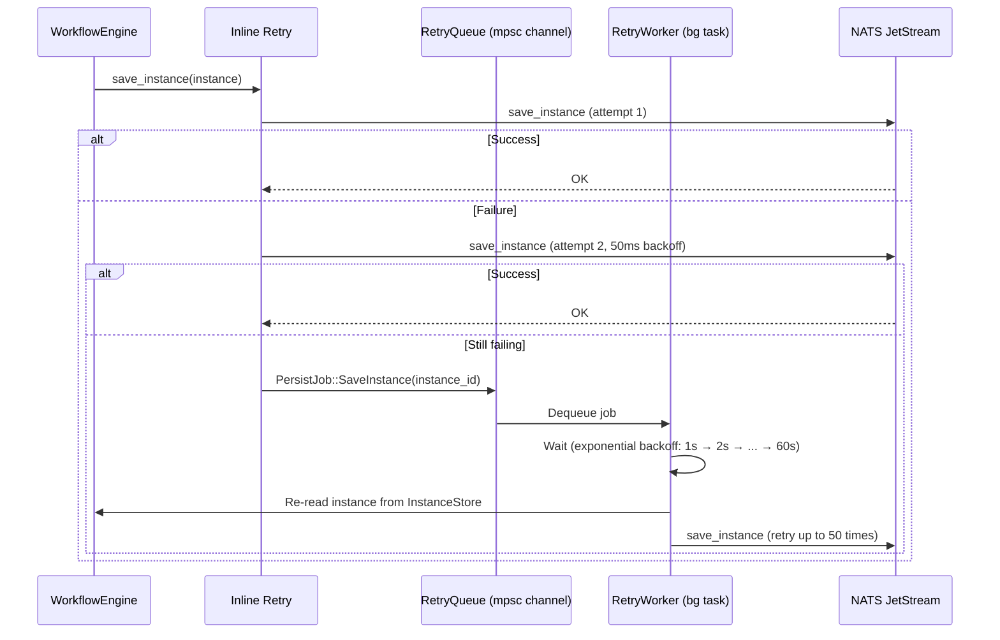

# Data Flows

## 1. Deployment Flow

## 2. Instance Execution Flow

## 3. Service Task (Fetch-and-Lock)

## 4. Timer Processing

## 5. SSE Event Push

## 6. Startup Restore Flow

## 7. Persistence Retry (Fault-Tolerant)

