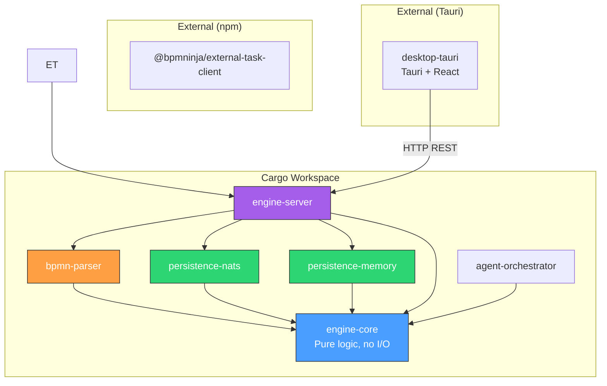

# Dependencies

## Crate-Level Dependency Graph

## Detailed Dependency Table

| Crate | Depends On (Rust) | Depends On (External) | Purpose |
|-------|------------------|----------------------|---------|
| **engine-core** | (none) | tokio, serde, serde_json, chrono, uuid, dashmap, rhai, thiserror, anyhow, tracing, async-trait | Core domain types + engine logic |
| **bpmn-parser** | engine-core | quick-xml, serde, chrono | Uses engine-core's `ProcessDefinition`, `BpmnElement`, `TimerDefinition`, `EngineError` |
| **persistence-nats** | engine-core | async-nats, serde_json, futures | Implements `WorkflowPersistence` trait from engine-core |
| **persistence-memory** | engine-core | serde_json, async-trait | Implements `WorkflowPersistence` trait from engine-core |
| **engine-server** | engine-core, bpmn-parser, persistence-nats, persistence-memory | axum, tokio, tower-http, uuid, metrics, metrics-exporter-prometheus, tracing, tracing-subscriber | Server binary; depends on all crates |
| **agent-orchestrator** | engine-core | tokio, reqwest | Example worker; uses engine-core for public types |
| **desktop-tauri** | (none — HTTP client) | @tauri-apps/api, bpmn-js, React, Tailwind | Thin HTTP client to engine-server |
| **external-task-client** | (none — HTTP client) | pino (logging) | Pure TypeScript HTTP client |

## Inbound Dependencies (Who Calls Me)

### engine-core
| Caller | How | For |
|--------|-----|-----|
| engine-server | Direct Rust import | All engine operations (deploy, start, tasks, timers, etc.) |
| bpmn-parser | Direct Rust import | Importing domain types (`ProcessDefinition`, `BpmnElement`) and error types |
| persistence-nats | Trait impl | Implementing `WorkflowPersistence` + using domain types |
| persistence-memory | Trait impl | Implementing `WorkflowPersistence` + using domain types |
| agent-orchestrator | Direct Rust import | Using public types for worker tasks |

### engine-server
| Caller | How | For |
|--------|-----|-----|
| desktop-tauri | HTTP REST | All BPMN operations |
| external-task-client | HTTP REST | fetchAndLock, complete, failure, bpmnError |
| External systems | HTTP REST | Message correlation, timer triggers |

### bpmn-parser
| Caller | How | For |
|--------|-----|-----|
| engine-server | Direct Rust import | Deploy endpoint: `parse_bpmn_xml(xml) → ProcessDefinition` |
| StartupCoordinator | Direct Rust import | Re-parsing definitions from NATS on startup |

## Key External Dependencies

| Dependency | Version | Used By | Purpose |
|-----------|---------|---------|---------|
| tokio | 1.52 | engine-core, engine-server | Async runtime |
| axum | 0.8 | engine-server | HTTP framework |
| quick-xml | 0.39 | bpmn-parser | XML deserialization |
| rhai | 1.19 | engine-core | Script evaluation |
| dashmap | 6.x | engine-core | Lock-free concurrent maps |
| async-nats | 0.47 | persistence-nats | NATS client |
| serde / serde_json | 1.0 | all crates | Serialization |
| chrono | — | engine-core, bpmn-parser, persistence-nats | Date/time handling |
| uuid | — | engine-core, engine-server | Identifier generation |
| metrics / metrics-exporter-prometheus | — | engine-server | Observability |
