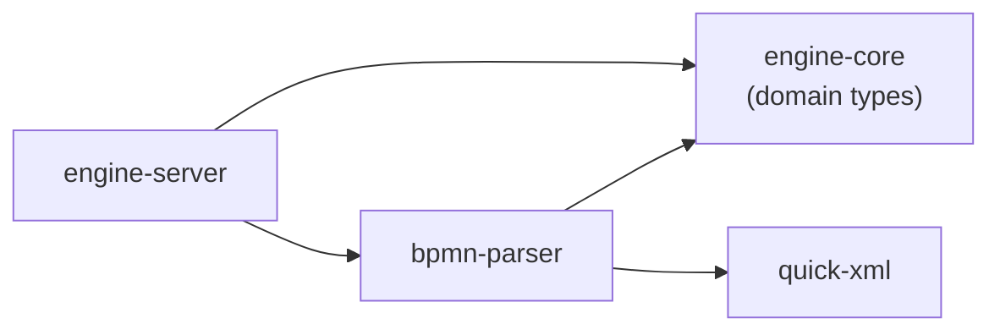

# bpmn-parser — Dependencies

## Outbound

| Dependency | Type | Purpose |
|-----------|------|---------|
| engine-core | Rust crate (direct) | Uses `ProcessDefinition`, `ProcessDefinitionBuilder`, `BpmnElement`, `TimerDefinition`, `SequenceFlow`, `ExecutionListener`, `ListenerEvent`, `MultiInstanceDef`, `EngineError`, `EngineResult` |
| quick-xml | External crate | XML deserialization (`quick_xml::de::from_str`) |
| serde | External crate | Deserialize XML elements into Rust structs |
| chrono | External crate | Parse absolute dates in timer definitions |

## Inbound

| Caller | How | For |
|--------|-----|-----|
| engine-server | Direct import | Deploy endpoint: `parse_bpmn_xml(xml) → ProcessDefinition`, then `engine.deploy_definition(def)` |
| engine-server (StartupCoordinator) | Direct import | Re-parsing definitions from NATS on server restart |

## Dependency Graph

