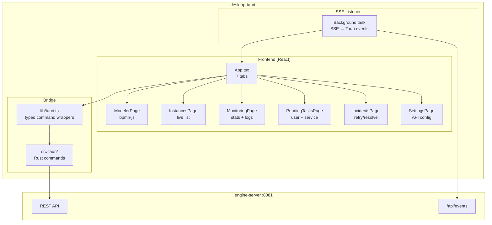

# desktop-tauri — Dependencies

## Outbound

| Dependency | Type | Purpose |
|-----------|------|---------|
| engine-server | HTTP REST | All BPMN operations via Tauri command proxy |
| engine-server | SSE | `/api/events` for real-time state updates |
| @tauri-apps/api | npm | Tauri bridge (invoke, events) |
| bpmn-js + bpmn-js-properties-panel | npm | BPMN diagram editor and properties panel |
| camunda-bpmn-moddle | npm | Camunda namespace moddle extensions |
| React 19 | npm | UI framework |
| @radix-ui/* | npm | UI primitives (dialog, tabs, accordion, select, scroll-area, toast, label) |
| Tailwind CSS 4 | npm | Utility-first styling |
| shadcn/ui | npm | Component library built on Radix |
| lucide-react | npm | Icons |
| react-markdown | npm | Markdown rendering (log entries, etc.) |
| xml-formatter | npm | BPMN XML formatting for display |
| Tauri 2.10 (src-tauri) | Cargo | Native shell, window management, file dialogs |

## Inbound

| Caller | How | For |
|--------|-----|-----|
| End users | Desktop app window | BPMN modeling, instance tracking, monitoring |
| CI (GitHub Actions) | Playwright tests | 48 E2E tests |

## Architecture Diagram

## Key npm Dependencies

| Package | Version | Purpose |
|---------|---------|---------|
| bpmn-js | ^18.16.1 | BPMN 2.0 diagram renderer and editor |
| bpmn-js-properties-panel | ^5.55.0 | Properties panel for bpmn-js |
| camunda-bpmn-moddle | ^7.0.1 | Camunda extension elements moddle |
| react | ^19.2.6 | UI framework |
| @tauri-apps/api | ^2.10.1 | Tauri frontend API |
| @tauri-apps/plugin-dialog | ^2.7.1 | File open/save dialogs |
| @tauri-apps/plugin-fs | ^2.5.1 | Filesystem access |
| tailwindcss | ^4.3.0 | CSS framework |
