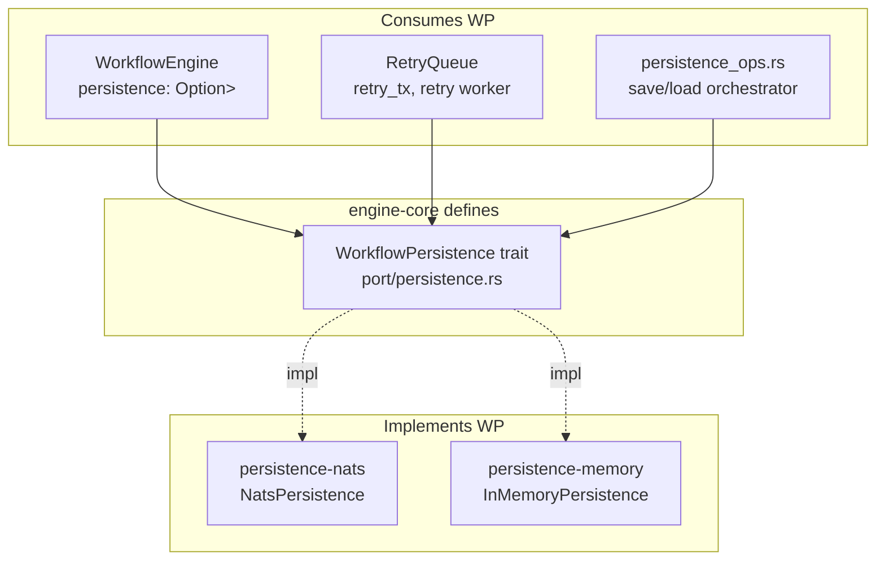

# engine-core — Dependencies

## Outbound (What engine-core Depends On)

| Dependency | Type | Purpose | Notes |
|-----------|------|---------|-------|
| tokio | External crate | Async runtime, broadcast channel, mpsc channel, mutex | Used for retry queue channel, event broadcast, `RwLock` |
| dashmap | External crate | Lock-free concurrent hash maps | Four wait-state queues |
| rhai | External crate | Scripting engine | Execution listeners, ScriptTasks |
| serde / serde_json | External crate | Serialization/deserialization | Domain types to JSON for persistence |
| chrono | External crate | Date/time handling | Timer expiry, timestamps, ISO 8601 |
| uuid | External crate | UUID generation | Identifier for instances, tasks, timers, tokens |
| async-trait | External crate | Async trait support | `WorkflowPersistence` trait with async methods |
| thiserror | External crate | Error type derivation | `EngineError` enum with all variants |
| anyhow | External crate | Error handling convenience | Not used in core — used by server/parser only |
| tracing | External crate | Structured logging | `info!`, `warn!`, `error!` macros |

**Critically, engine-core does NOT depend on:**
- async-nats (no NATS code)
- quick-xml (no XML parsing)
- axum (no HTTP)
- reqwest (no HTTP client)
- Any filesystem or network crate

## Inbound (Who Depends on engine-core)

| Caller | How | Purpose | Key Types Used |
|--------|-----|---------|---------------|
| **bpmn-parser** | Direct Rust import | Consumes domain types | `ProcessDefinition`, `BpmnElement`, `TimerDefinition`, `EngineError`, `EngineResult`, `SequenceFlow`, `ExecutionListener` |
| **persistence-nats** | Direct Rust import + trait impl | Implements `WorkflowPersistence` + uses domain types | `WorkflowPersistence`, `ProcessDefinition`, `ProcessInstance`, `Token`, `PendingUserTask`, `PendingServiceTask`, `PendingTimer`, `PendingMessageCatch`, `HistoryEntry`, `StorageInfo` |
| **persistence-memory** | Direct Rust import + trait impl | Implements `WorkflowPersistence` + uses domain types | Same as above |
| **engine-server** | Direct Rust import | All engine operations via REST handlers | `WorkflowEngine`, all domain types, all pending types, `EngineEvent`, `EngineError` |
| **agent-orchestrator** | Direct Rust import | Public types for worker tasks | `PendingServiceTask`, `EngineError` |

## Trait Relationship Diagram



## Key Cargo.toml Excerpt

```toml
[package]
name = "engine-core"
version = "0.7.19"
edition = "2024"

[dependencies]
tokio = { workspace = true }
thiserror = { workspace = true }
serde = { workspace = true }
serde_json = { workspace = true }
tracing = { workspace = true }
dashmap = "6"
async-trait = "0.1"
chrono = { version = "0.4", features = ["serde"] }
uuid = { version = "1", features = ["v4", "serde"] }
rhai = "1.19"
```
