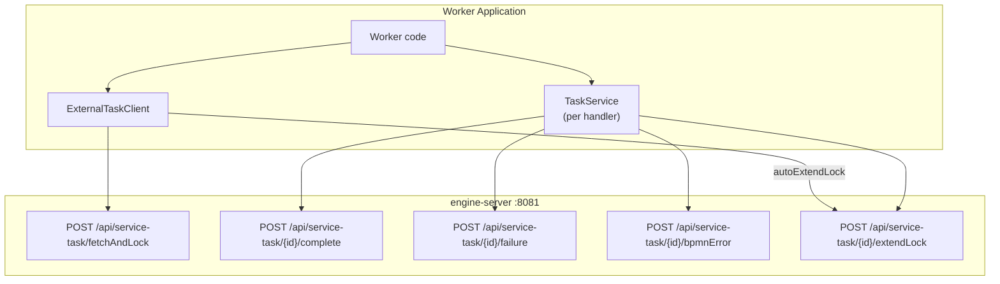

# external-task-client — Dependencies

## Outbound

| Dependency | Type | Purpose |
|-----------|------|---------|
| engine-server | HTTP REST | Service task API endpoints |
| pino | npm | Structured logging (optional, can disable) |
| pino-pretty | npm | Development log formatting |

**No other runtime dependencies.** The package uses native `fetch()` (Node ≥ 18).

## Inbound

| Caller | How | For |
|--------|-----|-----|
| External worker applications | npm import | Processing service tasks from BPMNinja engine |
| `example/simple-worker.ts` | Local import | Demo worker with 3 topic subscriptions |

## Architecture

## Dev Dependencies

| Dependency | Purpose |
|-----------|---------|
| typescript | Compiler |
| vitest | Test runner |
| tsx | Development script runner |
| @types/node | Node.js type definitions |
