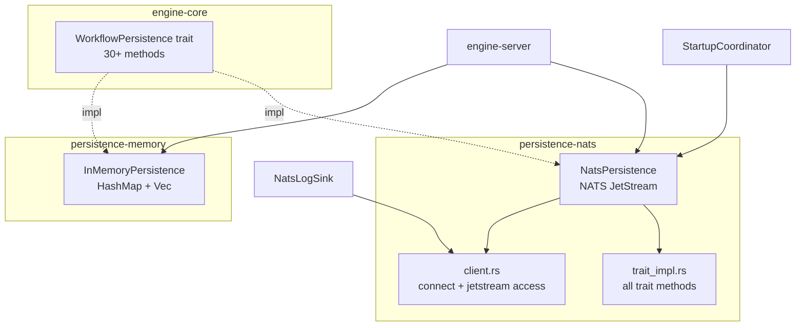

# persistence — Dependencies

## Outbound

| Dependency | Type | Used By | Purpose |
|-----------|------|---------|---------|
| engine-core | Rust crate | Both backends | `WorkflowPersistence` trait + all domain types |
| async-nats | External crate | persistence-nats | NATS JetStream client (KV, Object Store, Streams) |
| serde_json | External crate | Both backends | JSON serialization |
| futures | External crate | persistence-nats | Stream operations for KV key listing |
| tracing | External crate | persistence-nats | Logging (NATS connection status) |

## Inbound

| Caller | How | Backend | For |
|--------|-----|---------|-----|
| engine-server (main.rs) | Direct import | Both | NATS for production, fallback to in-memory |
| engine-core (WorkflowEngine) | Trait impl | Both | `Some(Arc<dyn WorkflowPersistence>)` |
| engine-core (retry_queue) | Trait impl | Both | Retry worker calls save/delete methods |
| engine-core (StartupCoordinator) | Direct import | NATS | `NatsPersistence::connect()` → restore state |
| engine-server (log_nats) | Direct import | NATS | `NatsLogSink::new(p.jetstream())` |

## Trait Implementation Diagram

## NATS KV Bucket Map

| Bucket Name | Content Type | Key Prefix | Purpose |
|------------|-------------|------------|---------|
| `definitions` | `ProcessDefinition` (JSON) | `def-{uuid}` | Immutable process definitions |
| `instances` | `ProcessInstance` (JSON) | `inst-{uuid}` | Live process instances |
| `user_tasks` | `PendingUserTask` (JSON) | `ut-{uuid}` | Awaiting user completion |
| `service_tasks` | `PendingServiceTask` (JSON) | `st-{uuid}` | External worker tasks |
| `timers` | `PendingTimer` (JSON) | `tmr-{uuid}` | Active timer triggers |
| `message_catches` | `PendingMessageCatch` (JSON) | `msg-{uuid}` | Message subscriptions |
| `tokens` | `Token` (JSON) | `token-{inst}-{token}` | Per-instance tokens |
| `bpmn_xml` | BPMN XML string | `xml-{uuid}` | Original BPMN source |
| `history` | `HistoryEntry` (JSON) | `hist-{uuid}` | Instance history events |

Additional:
- **Object Store** `instance_files`: Binary files, keyed by `file:{instance_id}-{var_name}-{filename}`
- **Stream** `WORKFLOW_EVENTS`: History event stream
- **Stream** `ENGINE_LOGS`: Persistent log buffer (50,000 entries)
