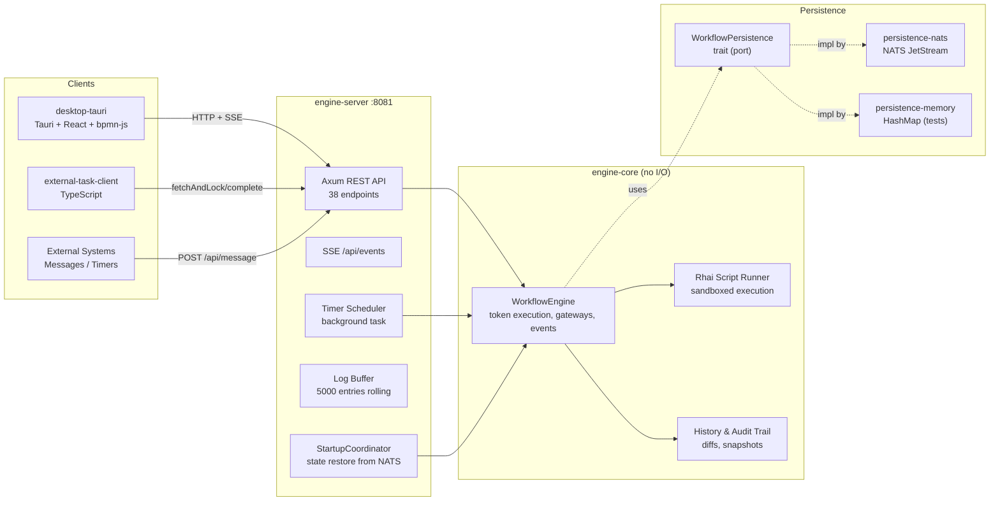

# Overview

## Project Mission

BPMNinja is a BPMN 2.0 workflow engine written in Rust — a Camunda-compatible but leaner alternative focused on token-based execution, lock-free concurrency via DashMap, NATS JetStream persistence, and a Tauri React desktop UI with live bpmn-js tracking.

**Version:** 0.7.19 (Rust crates + desktop), 1.0.0 (external-task-client npm package)

## Tech Stack

| Layer | Technology | Notes |
|-------|-----------|-------|
| Language | Rust (edition 2024) | Tauri src-tauri uses edition 2021 |
| Async Runtime | Tokio 1.x | full features |
| Web Framework | Axum 0.8 | REST API, SSE |
| XML Parser | quick-xml 0.39 + serde | BPMN 2.0 parsing |
| Scripting | Rhai 1.25 | Execution listeners, script tasks; sandboxed via ops/memory budget/timeout |
| Persistence | NATS JetStream (async-nats 0.49) | KV stores, Object Store, Streams |
| Concurrency | DashMap 6.x | Lock-free wait-state queues |
| Desktop | Tauri 2.10, React 19, bpmn-js 18 | Tailwind CSS 4 |
| External Client | TypeScript, ESM, Node ≥ 18 | Vitest tests |
| Metrics | metrics-exporter-prometheus | /metrics endpoint |
| Fuzzing | cargo-fuzz (libFuzzer) | 9 targets, AddressSanitizer |
| Mutation | cargo-mutants | engine-core; metrics via CI (`docs/quality-metrics.json`) |

## Workspace Structure

```
bpmninja/                          # Cargo workspace root (6 crates)
├── engine-core/                   # Pure state machine (no I/O)
├── bpmn-parser/                   # BPMN 2.0 XML → ProcessDefinition
├── persistence-nats/              # NATS JetStream WorkflowPersistence impl
├── persistence-memory/             # In-memory WorkflowPersistence impl (tests)
├── engine-server/                 # Axum REST API + background services
├── agent-orchestrator/            # Example external worker (stub)
├── bpmn-ninja-external-task-client/ # npm package (separate workspace)
├── desktop-tauri/                 # Tauri app (separate Cargo project + npm)
├── api-spec/                      # TypeSpec → OpenAPI
├── fuzz/                          # cargo-fuzz workspace (separate)
├── docs/                          # Architecture docs, OpenAPI, knowledge-base
└── test-results/                  # CI test artifacts
```

## Architecture Summary



## Key Design Decisions

- **@tag:hexagonal-architecture**: Engine core depends only on the `WorkflowPersistence` trait in `port/`. No network, disk, or NATS code in engine-core.
- **@tag:token-execution**: Execution uses a token model (`Token` structs in `ProcessInstance.tokens`). The `NextAction` enum drives the executor loop.
- **@tag:lock-free-concurrency**: `DashMap` for all four wait-state queues; per-instance `RwLock` via `InstanceStore`.
- **@tag:subprocess-flattening**: Embedded sub-processes are flattened into the main graph at parse time. No runtime scope nesting.
- **@tag:camunda-compatible**: Service tasks use Camunda's fetch-and-lock pattern. TypeScript client mirrors `camunda-external-task-client-js` API.
- **@tag:sse-push**: UI receives real-time state updates via SSE (`/api/events`), not polling.
- **@tag:fault-tolerant-retry**: Two-stage persistence retry: inline (50ms backoff) + **bounded** background worker queue (default capacity 10 000, exponential backoff, max 50 retries; drops + metrics when full).
- **@tag:fail-closed-durability**: Production/docker uses `REQUIRE_NATS=true` (fail-fast). Dev may run in-memory; `/api/ready` mirrors durability requirements.
- **@tag:rhai-sandbox**: Scripts limited by `RHAI_MAX_OPERATIONS`, `RHAI_MAX_MEMORY_BYTES` (derives collection size caps), `RHAI_TIMEOUT_MS`.

## Test Coverage

| Crate | Unit | E2E | Total |
|-------|------|-----|-------|
| engine-core | 217 | 5 | 222 |
| bpmn-parser | 32 | — | 32 |
| persistence-nats | 4 | — | 4 |
| engine-server | 1 | ~56 | ~57 |
| desktop-tauri | — | 48 | 48 |
| external-task-client | 68 | — | 68 |
| **Total** | **~322** | **~109** | **~431** |

> Counts approximate; `cargo test --workspace` is the source of truth.

## Production Hardening (env)

| Variable | Default | Role |
|----------|---------|------|
| `REQUIRE_NATS` | `false` | Fail-fast without NATS; readiness requires persistence |
| `MAX_UPLOAD_BYTES` | `5 MiB` | Multipart instance-file upload limit → HTTP 413 |
| `PERSISTENCE_RETRY_QUEUE_CAPACITY` | `10000` | Bounded retry queue depth |
| `RHAI_MAX_MEMORY_BYTES` | `2 MiB` | Script memory budget (collection caps) |

## Boundaries & Invariants

1. `engine-core` has **zero** `.unwrap()` in production code; all errors use `thiserror` + `anyhow`.
2. All async locks must be scoped — **never** hold a lock across `.await`.
3. `BpmnElement` is a closed enum — all match arms must be exhaustive.
4. `ProcessDefinition` is immutable after deployment (`Arc<ProcessDefinition>`).
5. Persistence operations go through the `retry_queue` — never directly called from engine logic.
6. SSE events broadcast via `tokio::sync::broadcast` channel (capacity 256) — slow consumers don't block writers.
7. `/api/health` = liveness (always 200 when process up); `/api/ready` = durability readiness (503 if required persistence missing or NATS down).
